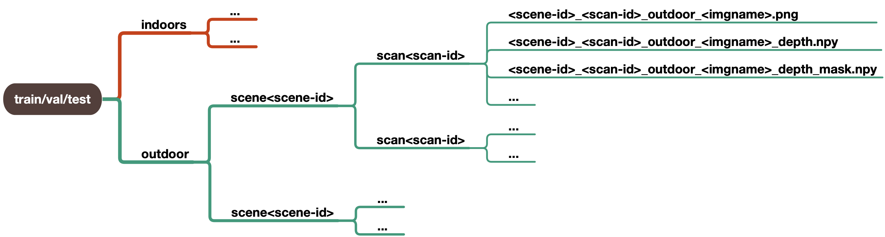

# DIODE: A Dense Indoor and Outdoor DEpth Dataset


DIODE (Dense Indoor/Outdoor DEpth) is a dataset that contains diverse high-resolution color images with accurate, dense, and far-range depth measurements. DIODE is the first public dataset to include **RGBD images of indoor and outdoor scenes obtained with one sensor suite**.

Refer to our [homepage](https://diode-dataset.org) and [technical report](https://arxiv.org/abs/1908.00463) for more details.

### Dataset Download
|     Partition      |                      Amazon Web Service                      | Tencent Cloud                                                |             MD5 Hash             |
| :----------------: | :----------------------------------------------------------: | ------------------------------------------------------------ | :------------------------------: |
|    Train (81GB)    | [train.tar.gz](http://diode-dataset.s3.amazonaws.com/train.tar.gz) | [train.tar.gz](https://diode-dataset-1254389886.cos.ap-shanghai.myqcloud.com/train.tar.gz) | 3a94632398fe1d002d89f11743f748b1 |
| Validation (2.6GB) | [val.tar.gz](http://diode-dataset.s3.amazonaws.com/val.tar.gz) | [val.tar.gz](https://diode-dataset-1254389886.cos.ap-shanghai.myqcloud.com/val.tar.gz) | 5c895d09201b88973c8fe4552a67dd85 |

### Dataset Layout
DIODE data is organized hierarchically.


### File Naming Conventions and Formats
We have released RGB images, depth maps and depth validity masks:

  RGB images (`*.png`): RGB images with a resolution of 1024 × 768.

  Depth maps (`*_depth.npy`): depth ground truth with the same resolution as the images.

  Depth validity masks (`*_depth_mask.npy`): validity masks where 1 denotes valid sensor return and 0 otherwise.

### Devkit
This development toolkit contains
1. A json file that enumerates the data in DIODE. The layout of this file is explained in diode.py. It serves as the single point of reference during dataloading.
2. A sample pytorch data loading module.
3. A jupyter-notebook demo showcasing data loading, metadata querying and depth visualization.


### Citation
```
@article{diode_dataset,
    title={{DIODE}: {A} {D}ense {I}ndoor and {O}utdoor {DE}pth {D}ataset},
    author={Igor Vasiljevic and Nick Kolkin and Shanyi Zhang and Ruotian Luo and 
            Haochen Wang and Falcon Z. Dai and Andrea F. Daniele and Mohammadreza Mostajabi and 
            Steven Basart and Matthew R. Walter and Gregory Shakhnarovich},
    year = {2019}
    journal={CoRR},
    volume={abs/1908.00463},
    year = {2019},
    url={http://arxiv.org/abs/1908.00463}
}
```
### Contact
If you have any questions, please contact us at [diode.dataset@gmail.com](diode.dataset@gmail.com).
